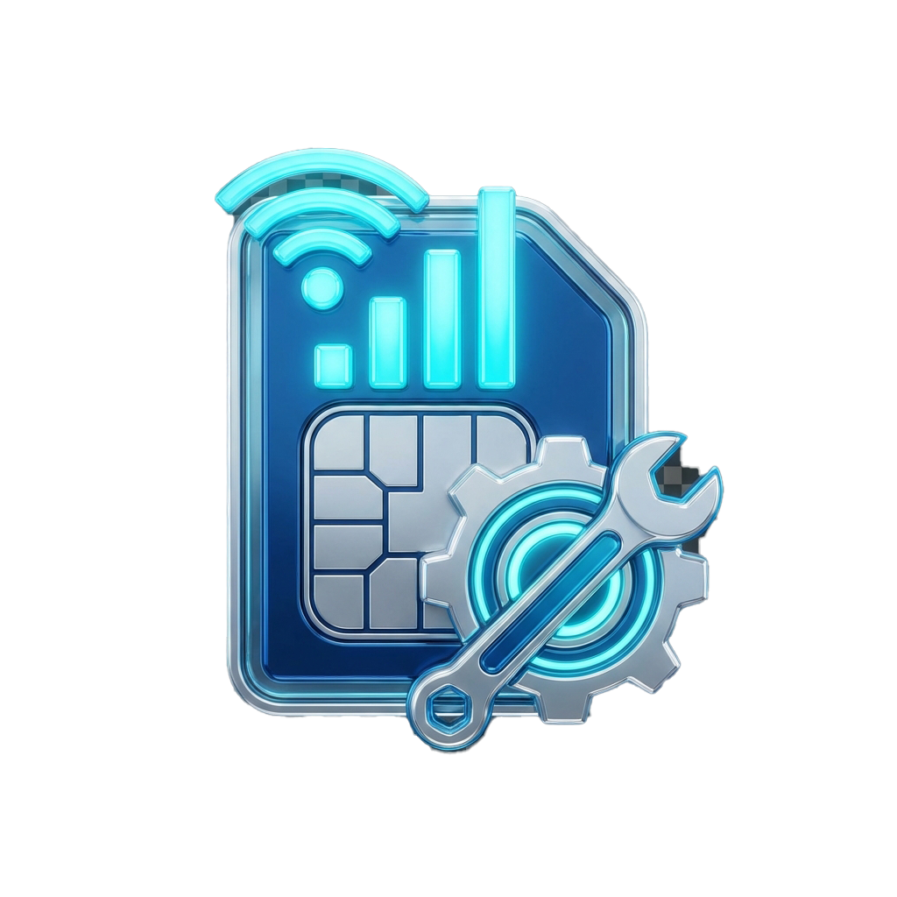
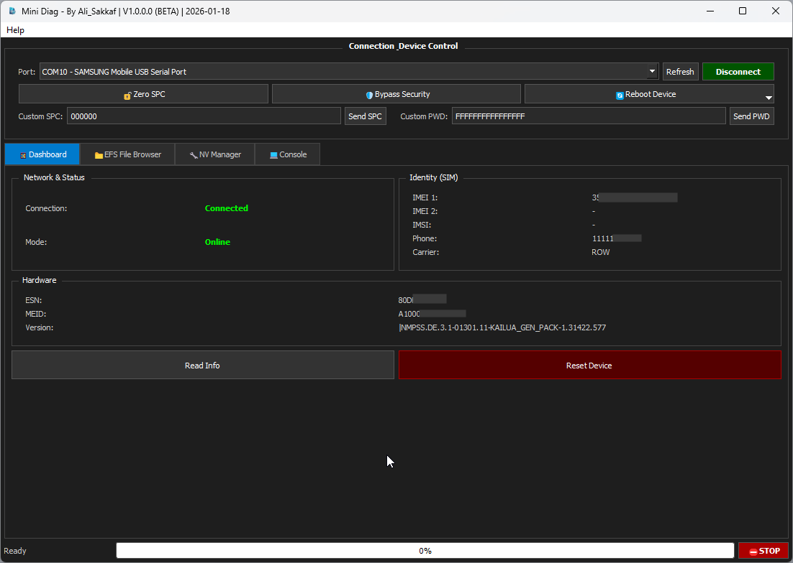
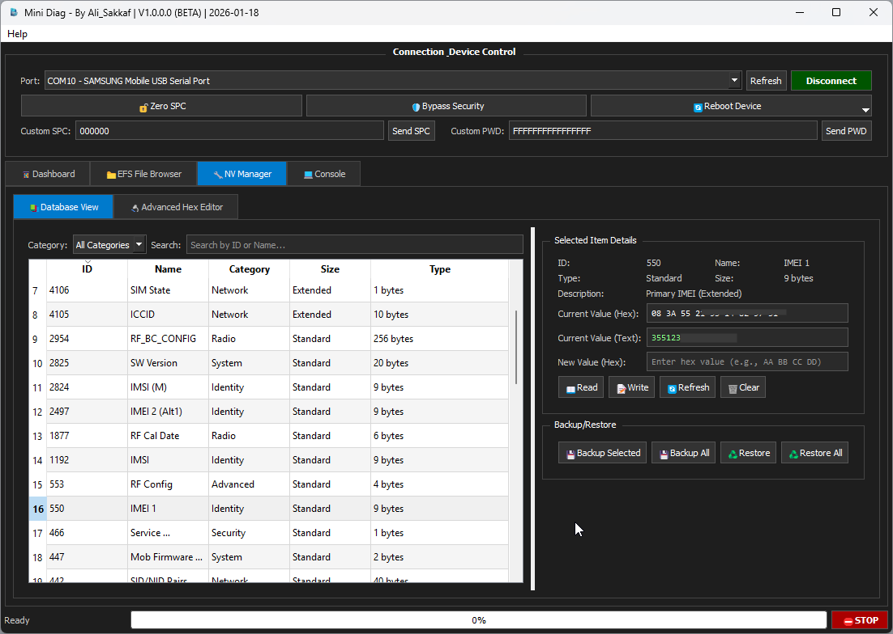
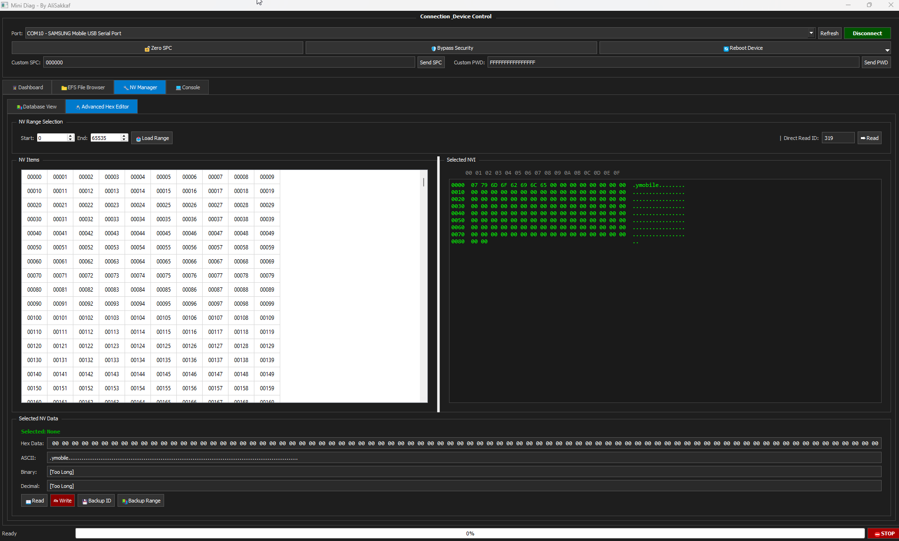

  
  <h1>Mini Diag Tool</h1>
  <h3>🚀 Native Standalone Qualcomm DIAG / EFS / NV Manager</h3>
  
<b>Direct Raw Protocol Implementation | Zero External DLLs | Pure Native C++</b>

  
  
  
  

   
  

---

## 💡 Core Philosophy & Features

**Mini Diag Tool** is an advanced, driver-less hardware diagnostic tool built entirely from scratch in native C++ and Qt to handle Qualcomm chipsets without relying on heavy external wrappers (`QPST.dll`, `QMSL`, or third-party engines).

* **⚡ 100% Standalone:** Zero external DLL dependencies. Talks directly to COM serial ports.
* **🔌 Native HDLC & CRC-16 Engine:** Low-level implementation of HDLC framing (`0x7E`/`0x7D` escaping) and CRC-16 checksum verification for sub-millisecond response latency.
* **📶 Complete Dual-SIM (SIM 1 & SIM 2) Architecture:** Native SIM selection controls with mutual exclusion and independent identity/EFS parsing.
* **🔍 Silent SIM 2 Auto-Discovery:** Automatic background path discovery across 7 Qualcomm dual-SIM base paths (`/nv/item_files_1/`, `/policyman_1/`, etc.) with path masking.
* **⚙️ 3-Tier NV Fallback Engine:** Smart automatic fallback across Standard (`0x26`), Subsystem (`0x4B`), and Extended (`0x75`) DIAG commands, providing full compatibility with Snapdragon 8 Gen 1/2/3 chipsets.
* **🛡️ Watchdog-Protected Range Backup:** Unstoppable NV range backup with a dedicated 250ms watchdog timer (`m_backupWatchdog`) and 100ms item deadline to skip unpopulated NV IDs instantly.

---

## 📸 Interface Showcase

  <h3>📊 Dashboard & Identity Parsing</h3>
  
    
  <h3>⚙️ NV Manager & Advanced Hex Editor</h3>
  
    
  <h3>🖥️ Full Application View</h3>
  

---

## 🔬 Technical Specs & Capabilities

### 📊 1. Intelligent Dashboard
- **Identity Parsing:** IMEI 1, IMEI 2 (SIM 2), ESN, MEID, IMSI.
- **Network & Carrier:** MDN (Phone Number), MCC/MNC codes, Carrier Banner.
- **System Info:** Firmware Version, Hardware Config, Mode Snapshot (Online, FTM, EDL).

### 📂 2. EFS Explorer (Modem Filesystem)
- **Directory Traversal:** Safe recursive file listing and folder operations.
- **Dual-SIM EFS Browsing:** Seamless switching between SIM 1 and SIM 2 internal modem partitions.
- **High-Speed I/O:** Upload, Download, Read, Write, and Delete modem items.

### ⚙️ 3. Advanced NV Manager (Dual View & Hex Editor)
- **Database View:** Built-in repository of critical NV items.
- **Advanced Hex Editor:** Raw memory view with Hex, ASCII Text, Binary, and Decimal formatting.
- **Subsystem & Extended NV:** Full support for high-range NV IDs (>4000) and multi-index items.

### 🛡️ 4. Range Backup & Restore Engine
- **Watchdog Protection:** Dedicated `m_backupWatchdog` timer prevents queue hangs.
- **Fast Timeout:** 100ms per unpopulated NV ID.
- **Binary (.nv) & JSON Backups:** Export and restore custom NV range backups.

### 🔧 5. Security & Device Control
- **SPC / PWD Reset:** Read, Write, or Zero-out SPC codes.
- **Security Bypass:** Unlock write permissions on protected modems.
- **Reboot Control:** Switch modes instantly (`Diag`, `FTM`, `EDL 9008`, `Reset`).

---

## 🔗 Official Links & Connect

* **Official Website:** [https://alisakkaf.com/](https://alisakkaf.com/)
* **GitHub Profile:** [https://github.com/alisakkaf/](https://github.com/alisakkaf/)
* **Repository:** [https://github.com/alisakkaf/QC-Native-Diag](https://github.com/alisakkaf/QC-Native-Diag)
* **Facebook Page:** [https://www.facebook.com/AliSakkaf.Dev/](https://www.facebook.com/AliSakkaf.Dev/)

---

## 💡 Support the Developer

If you find my tools and projects useful, consider supporting my work. Your support helps keep these projects completely free and open source!

| Crypto Asset | Network | Wallet Address (Copy) | Quick Scan |
| :--- | :--- | :--- | :---: |
|  | **TRC20** | `TYLBeDA5aGNcc3WkVqf3xWPHXmsZzs2p28` |  |
|  | **BEP20** | `0x67cf27f33c80479ea96372810f9e2ee4c3b095c5` |  |
|  | **Bitcoin** | `bc1q97dr37h37npzarmmrv0tjz2nm50htqc7pfpzj6` |  |
|  | **ERC20** | `0x67cf27f33c80479ea96372810F9e2EE4C3b095C5` |  |
|  | **Solana** | `Cbesgr4tvo4T1inNMFe46GSym2qMYjkmofbXFc77rDNK` |  |

---

## ⚖️ License & Disclaimer

This software is provided **"AS IS"**, without warranty of any kind. The developer is not responsible for device damage caused by misuse. Refer to [LICENSE](LICENSE) and [DISCLAIMER.md](DISCLAIMER.md) for complete details.

  Created with ❤️ by <b>Ali Sakkaf</b> | <a href="https://alisakkaf.com/">alisakkaf.com</a>

